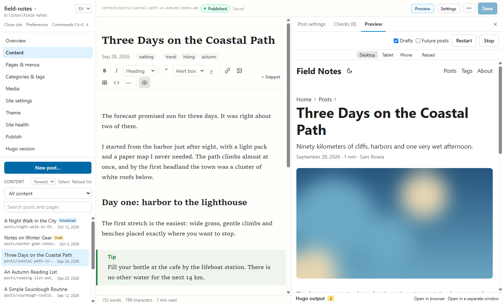
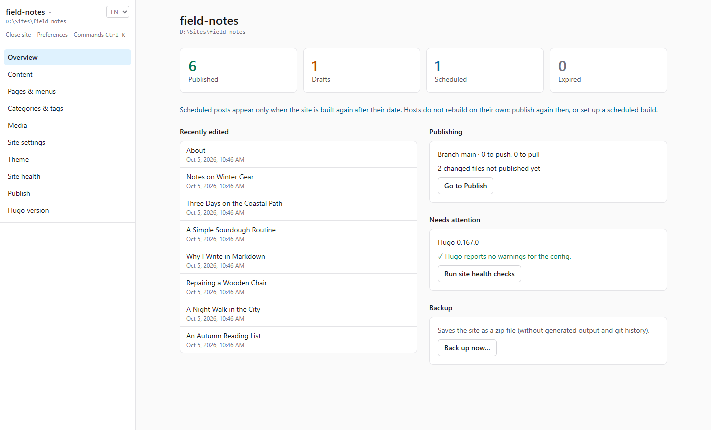
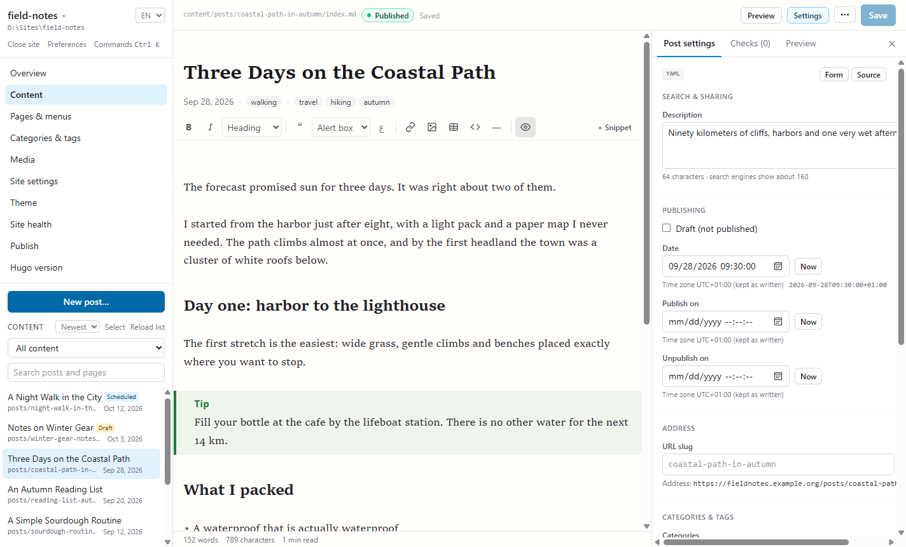
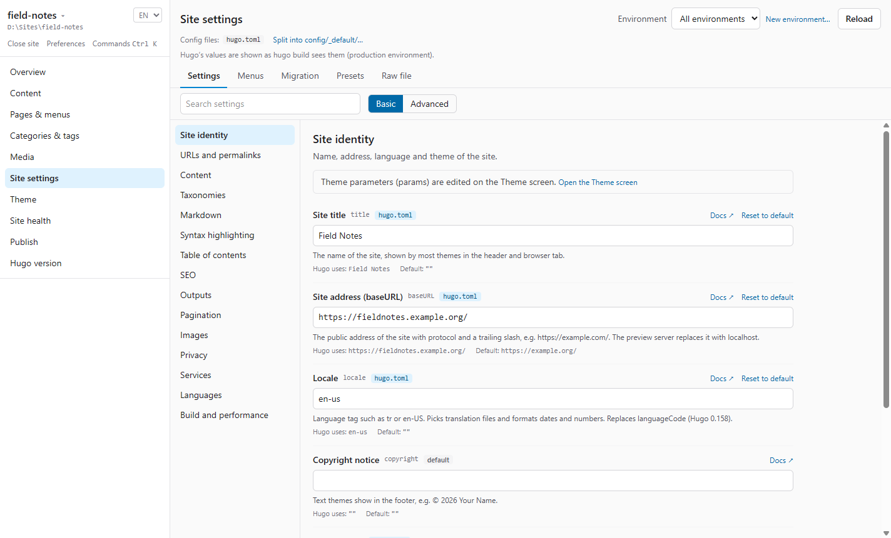
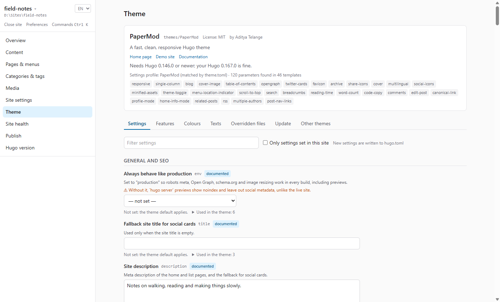
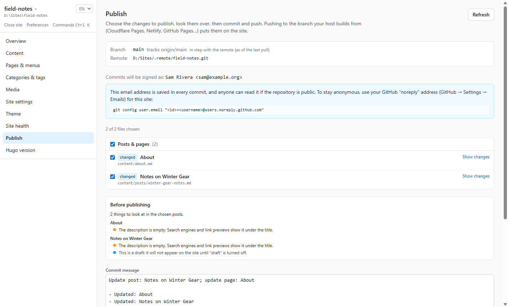
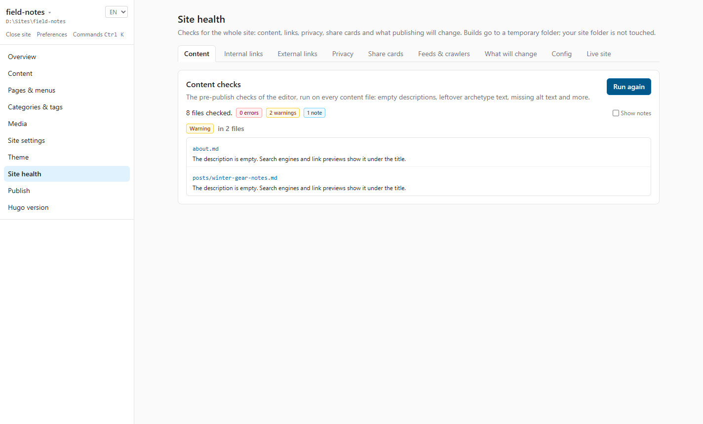

# Hugo Publisher

[English](README.md) · **Türkçe**

[Hugo](https://gohugo.io) siteleri için yazma, ayarlama ve yayınlama uygulaması: görsel bir Markdown editörü, `hugo.toml` ve tema ayarları için formlar, Hugo'nun kendisinin oluşturduğu canlı önizleme ve git ile commit ve push. Her Hugo sitesi ve her temayla çalışması hedefleniyor. [Tauri 2](https://v2.tauri.app), React ve Rust ile yazılıyor; Windows, macOS ve Linux için.

> [!IMPORTANT]
> **Durum: ön sürüm (0.1.0).** Aşağıdaki özellikler yazıldı ve testlerle denetleniyor; uygulama gerçek sitelerde deneniyor. **Henüz bir release yok**; [kaynaktan derleyebilirsin](#kaynaktan-derlemek).



## Özellikler

**Yazma**
- Metni öne alan bir yazma ekranı: önce büyük bir başlık, sonra yazının kendisi. Tarih, kategori ve etiketler başlığın altında tek satırda; yazı ayarları, kontroller ve önizleme istediğinde açılan bir yan panelde.
- Canlı biçimlendirmeli Markdown editörü (CodeMirror 6): Markdown sözdizimi bilmek gerekmez; araç çubuğu ve `/` menüsü, bilgi kutuları (`> [!NOTE]`), Arapça yazı tipli sağdan sola bloklar, tablolar, görev listeleri, görsel önizlemeleri, ham mod, odak modu.
- Hugo shortcode'ları parametre formlu çipler olarak; bilinmeyen shortcode'lar kilitlenir, yanlışlıkla bozulmaz.
- `[[` ile iç bağlantı tamamlama, Word ve Google Docs'tan temiz yapıştırma, görsel yapıştırma ve sürükle-bırak (meta veri temizlenir).
- Kişisel sözlüklü Türkçe ve İngilizce yazım denetimi; kelime sayısı ve okuma süresi.
- YAML ve TOML için front matter formu: tarihler kendi biçiminde, otomatik tamamlamalı kategori ve etiketler, görseller, temanın sayfa parametreleri, diğer tüm alanlar; kaynak görünümü.
- Kullanıcı tanımlı snippet'ler (kaynakça kartı, ürün kartı…), formlu; sıfırdan ya da bir shortcode'dan.
- Diff ve geri yüklemeli yerel sürüm geçmişi, otomatik `aliases` ile yeniden adlandırma/taşıma, arketipli ve dile duyarlı slug'lı yeni yazı sihirbazı.
- İsteğe bağlı yapay zekâ yardımı (kapalı başlar; kendi Anthropic API anahtarın, işletim sisteminin anahtar zincirinde): başlık, açıklama, alt metin ve çeviri önerileri.

**Önizleme ve site**
- Kendi temanla, `hugo server` üzerinden önizleme; düzenlediğin sayfayı takip eder; masaüstü, tablet ve telefon genişlikleri.
- Pano, filtreli ve toplu işlemli içerik listesi, sayfalar ve menüler, kategoriler ve etiketler (yeniden adlandırma, birleştirme, benzer terimler), çok dilli siteler için çeviriler.
- Medya kütüphanesi: EXIF/GPS ve diğer meta verileri bulma ve yeniden kodlamadan silme, boyutlandırma, kullanılmayan görseller.

**Ayarlar ve tema**
- `hugo.toml`'un (ya da `config/`) tamamı, yorumları ve biçimi koruyan formlarla; kaynak ve etkin değerler, ortamlar, eskiyen anahtarlar için göç asistanı, hazır paketler, permalink test aracı, sürükle-bırak menü editörü, ham mod. Her değişiklik önce diff olarak gösterilir ve yazılmadan önce Hugo ile denetlenir.
- Her tema için tema ayarları: hazır şemalar, şablon taraması ve temanın varsayılanları, hiçbiri yoksa genel editör; renkler, özel CSS, tema metinleri (i18n), ezilen dosyalar.
- Drift tespiti ve ezilen dosyalar için 3 yönlü birleştirmeyle tema güncelleme, tema galerisi ve tema değiştirme.

**Yayın ve kontroller**
- Git: insan diliyle gruplanmış değişiklikler, diff, önerilen commit mesajı, pull ve push (asla force-push yok). gh-pages ile yayın, GitHub check'lerinden yayın durumu, canlı sayfa doğrulaması, bildirimler, ileri tarihli yazılar için zamanlanmış derleme, taslak paylaşım linki.
- Yayın öncesi kontroller ve site sağlığı: içerik kontrolleri, iç ve dış bağlantılar, gizlilik denetimi (dış istekler, git kimliği, tarihlerdeki saat dilimi), paylaşım kartı önizlemesi, RSS ve robots, "ne değişecek", config uyarıları.
- Hugo sürüm yönetimi: tespit, checksum doğrulamalı indirme, sürüm sabitleme ve yayın ortamıyla sürüm eşitliği.
- Yeni site sihirbazı, son siteler ve site değiştirme, komut paleti (Ctrl+K), yedekleme, Türkçe ve İngilizce arayüz.

## Ekran görüntüleri

<table>
  <tr>
    <td width="50%"><br><b>Genel bakış</b>: yayında, taslak ve ileri tarihli yazılar, son düzenlenenler, yayın bekleyenler ve Hugo'nun uyarıları.</td>
    <td width="50%"><br><b>Yazı ayarları</b>: front matter için form; tarihler kendi saat dilimiyle korunur, yazının son adresi görünür.</td>
  </tr>
  <tr>
    <td><br><b>Site ayarları</b>: <code>hugo.toml</code>'un tamamı formlarla; her alanın yanında Hugo'nun gerçekte kullandığı değer ve varsayılan.</td>
    <td><br><b>Tema</b>: temanın kendi parametreleri, şablonlarından bulunur; her birinin ne işe yaradığıyla.</td>
  </tr>
  <tr>
    <td><br><b>Yayınla</b>: insan diliyle değişiklikler, yayın öncesi kontroller, önerilen commit mesajı, sonra commit ve push.</td>
    <td><br><b>Site sağlığı</b>: içerik, bağlantılar, gizlilik, paylaşım kartları, RSS ve yayınla neyin değişeceği.</td>
  </tr>
</table>

Ekran görüntüleri İngilizce arayüzle alındı; uygulama Türkçe de kullanılabilir.

## İlkeler

- **Dosyalar tek gerçek kaynak.** Veritabanı yok. Aynı siteyi VS Code ile düzenlemeye devam edebilirsin; uygulama dışarıdan yapılan değişiklikleri fark eder.
- **Dokunulmayan byte değişmez.** Yorumlar, tırnaklar, satır sonları (LF/CRLF), BOM ve tarihlerdeki saat dilimi olduğu gibi kalır. Markdown asla baştan üretilmez.
- **Önce göster, sonra yaz.** Config değişiklikleri önce diff olarak gösterilir; her şey geri alınabilir.
- **Telemetri yok.** Uygulama yalnızca kullandığın özellikler için internete çıkar: git fetch ve push, Hugo ya da tema indirme, bağlantı denetimi, yayın durumu, açılışta güncelleme denetimi (Tercihler'den kapatılabilir) ve açarsan yapay zekâ yardımı.

## Platformlar

Ana geliştirme platformu Windows. macOS ve Linux build'leri her push'ta CI'da derlenip testlerden geçiyor ama **deneysel**: geliştiriciler Windows kullanıyor; test edecekleri bir Mac ya da Linux makineleri yok. macOS ya da Linux kullanıyorsan bir build'i deneyip [platform raporu](https://github.com/aligoren/hugo-publish/issues/new?template=platform-report.yml) açman çok işe yarar.

| Platform | Dosyalar (release'ler çıkınca) |
|---|---|
| Windows x64 | `*_x64-setup.exe` (NSIS kurulum), `*_x64_en-US.msi` |
| macOS (Apple Silicon ve Intel) | `*_universal.dmg`, `*.app.tar.gz` |
| Linux x64 | `*_amd64.AppImage`, `*_amd64.deb`, `*.x86_64.rpm` |

Hugo Publisher sistemindeki `git` ve `hugo` (tercihen extended sürüm) programlarını kullanır. İkisi de uygulamanın içinde gelmez.

## İmzasız build'i kurmak

Release'ler **kod imzalı değil**: ücretli sertifika yok. Bunun yerine her dosya, etiketli bir commit'ten herkese açık bir GitHub Actions workflow'unda derlenir, `SHA256SUMS.txt` içinde listelenir ve imzalı bir build attestation kaydı taşır (bkz. [Dosyaları doğrulamak](#dosyaları-doğrulamak)). İşletim sistemin uygulamayı ilk açışında bir kez uyarır.

**Windows.** SmartScreen "Windows bilgisayarınızı korudu" der. **Ek bilgi**'ye, ardından **Yine de çalıştır**'a tıkla.

**macOS 15 ve sonrası.** Uygulama ad-hoc imzalı ama Apple tarafından onaylanmış (notarize) değil, bu yüzden ilk açılış engellenir. **Bitti**'ye tıkla, **Sistem Ayarları → Gizlilik ve Güvenlik**'i aç, Hugo Publisher ile ilgili mesaja kadar aşağı kaydır ve **Yine de Aç**'a tıklayıp onayla. Ya da uygulamayı Uygulamalar klasörüne kopyaladıktan sonra Terminal'de:

```sh
xattr -dr com.apple.quarantine "/Applications/Hugo Publisher.app"
```

**Linux.**

```sh
chmod +x Hugo.Publisher_*_amd64.AppImage && ./Hugo.Publisher_*_amd64.AppImage
sudo apt install ./Hugo.Publisher_*_amd64.deb      # Debian, Ubuntu
sudo dnf install ./Hugo.Publisher-*.x86_64.rpm     # Fedora
```

AppImage açılmazsa FUSE 2'yi kur (`libfuse2`; Ubuntu 24.04 ve sonrasında `libfuse2t64`).

## Dosyaları doğrulamak

SHA-256 değerini aynı release'teki `SHA256SUMS.txt` ile karşılaştır:

```sh
sha256sum -c --ignore-missing SHA256SUMS.txt         # Linux
shasum -a 256 -c --ignore-missing SHA256SUMS.txt     # macOS
```

```powershell
# Windows: çıktıyı SHA256SUMS.txt içindeki o dosyanın satırıyla karşılaştır
(Get-FileHash .\Hugo.Publisher_0.1.0_x64-setup.exe -Algorithm SHA256).Hash
```

Dosyanın nerede derlendiğini [GitHub CLI](https://cli.github.com) ile denetle:

```sh
gh attestation verify Hugo.Publisher_0.1.0_x64-setup.exe --repo aligoren/hugo-publish
```

Bu komut, dosyanın bu reponun GitHub Actions'taki release workflow'u tarafından üretildiğini kanıtlar ve hangi commit'ten derlendiğini gösterir. `SHA256SUMS.txt` dosyasının da attestation kaydı var.

## Kaynaktan derlemek

Kendi derlemediğin bir programı çalıştırmak istemiyorsan [`scripts/`](scripts/) altındaki scriptler uygulamayı kendi bilgisayarında derler. Kısalar; lütfen önce oku. Sormadan hiçbir şey kurmazlar: eksik araçları, kurulum komutuyla birlikte yazarlar. Bağımlılıklar kilit dosyalarından kurulur (`npm ci`, `cargo build --locked`); araç sürümleri [`rust-toolchain.toml`](rust-toolchain.toml) ve [`.nvmrc`](.nvmrc) dosyalarında sabit.

Gereksinimler:

- **Hepsi:** [rustup ile Rust](https://rustup.rs) (sonra sabit sürümü almak için repo klasöründe `rustup toolchain install`), Node.js 24 ya da üstü, git.
- **Windows:** "Desktop development with C++" seçili [Build Tools for Visual Studio](https://visualstudio.microsoft.com/visual-cpp-build-tools/). WebView2 Windows 11 ile hazır gelir.
- **macOS:** Xcode Command Line Tools (`xcode-select --install`).
- **Linux:** WebKitGTK 4.1, librsvg ve diğerleri ([liste](https://v2.tauri.app/start/prerequisites/#linux)). `bash scripts/build.sh --install-deps` apt, dnf, pacman ya da zypper için doğru komutu gösterir ve çalıştırmadan önce sorar.

```sh
git clone https://github.com/aligoren/hugo-publish.git
cd hugo-publish

# Windows (PowerShell)
powershell -ExecutionPolicy Bypass -File scripts\build.ps1 -CheckOnly   # yalnızca gereksinim kontrolü
powershell -ExecutionPolicy Bypass -File scripts\build.ps1

# macOS, Linux
bash scripts/build.sh --check-only
bash scripts/build.sh
```

Paketler `src-tauri/target/release/bundle/` altına çıkar; script yollarını ve SHA-256 değerlerini yazar. Hash'lerin release dosyalarıyla aynı olmaz, çünkü build'ler bit bit tekrarlanabilir değil. Kendi derlediğin uygulama karantinaya alınmaz, bu yüzden macOS onu "Yine de Aç" adımı olmadan açar.

## Geliştirme

Gereksinimler yukarıdakilerle aynı; entegrasyon testleri için ayrıca `hugo` (extended).

```sh
npm install
npm run tauri dev     # uygulamayı anında yenilemeyle çalıştırır

npm test              # ön yüz testleri (Vitest)
npm run lint          # oxlint
npm run typecheck

cd src-tauri
cargo test            # Rust testleri
```

Rust entegrasyon testleri gerçek `hugo` çalıştırır. `hugo` `PATH` üzerinde değilse atlanırlar; bunun hata sayılması için `HUGO_PUBLISHER_REQUIRE_HUGO=1` ayarla (CI böyle çalışır). CI ([`.github/workflows/ci.yml`](.github/workflows/ci.yml)) bunların hepsini Windows, macOS ve Linux'ta çalıştırır.

## Lisans

[MIT](LICENSE)
